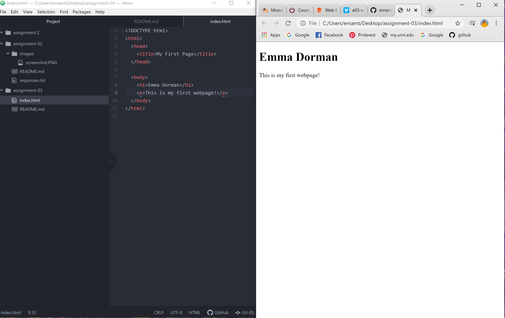

Browsers function through their rendering engine which helps develop content to be viewed online. The browser engine directs actions between the user interface and the rendering engine. Everything is communicated over the internet. Browsers have different translators to identify information being sent through networks. The only browser I use is Chrome.
Markup language dictates the architecture of a page, with a focus on its text content. HTML is commonly used in development.

